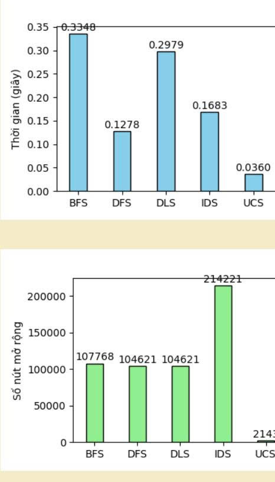
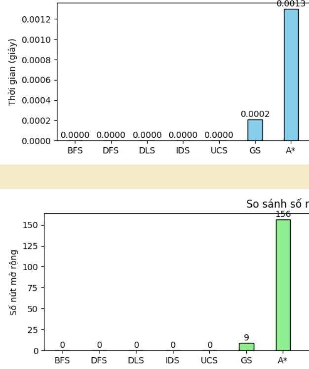
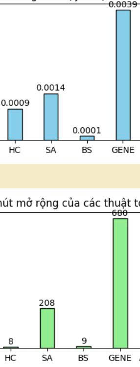
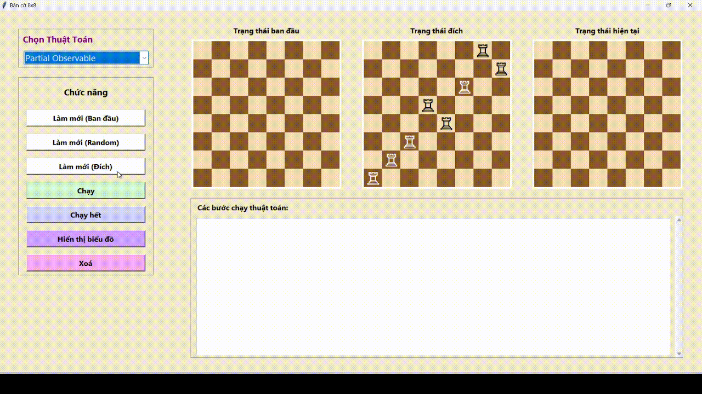
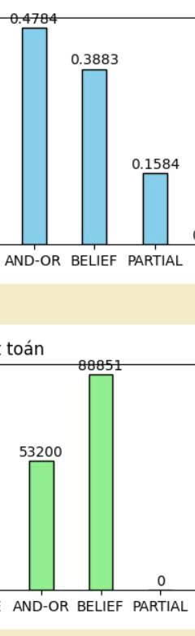
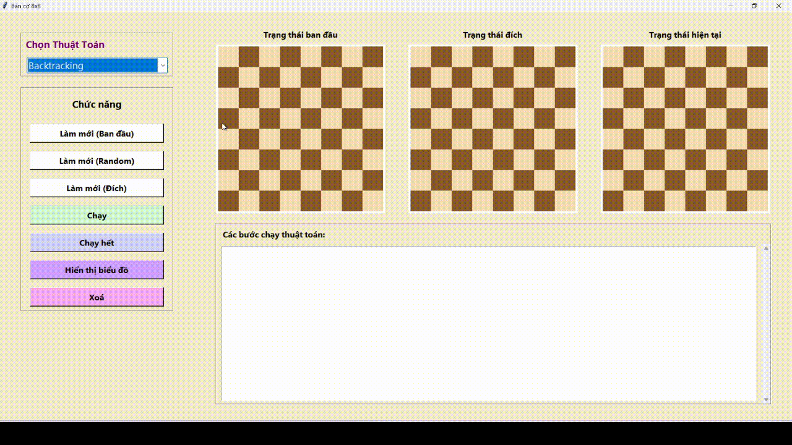
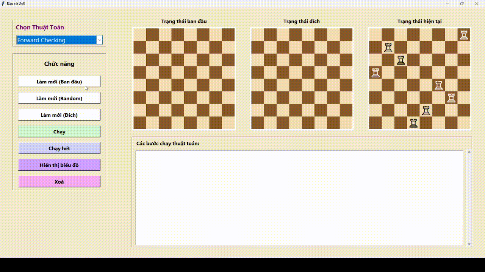
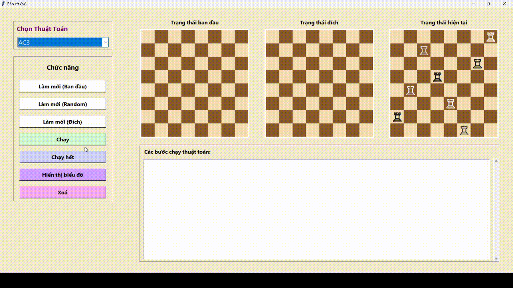
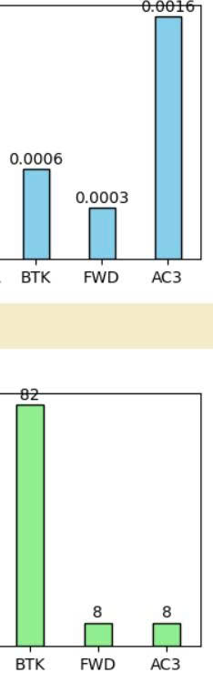

# Báo cáo đồ án cá nhân cuối kì

---
## Giới thiệu
Đề tài: Giải bài toán con xe bằng giải thuật tìm kiếm   
GVHD: Phan Thị Huyền Trang  
Tên: Huỳnh Gia Diễm Ngọc  
MSSV: 23110132
---

## Mục tiêu

Mô phỏng bàn cờ 8x8 bao gồm 8 con xe, sử dụng các thật toán tìm kiếm khác nhau của môn học Trí Tuệ Nhân Tạo để đặt các quân xe đúng các quy tắc (8 quân xe không quân nào ăn nhau), 
đồng thời so sánh hiệu quả của các thuật toán khác nhau trong môn học này. Ứng dụng cung cấp giao diện để người dùng có thể quan sát trạng thái ban đầu, trạng thái mục tiêu, 
trạng thái hiện tại, xem qu trình từng bước của mỗi thuật toán và so sánh giữa các thuật toán.

---
## Nội dung
### 1. Các thuật toán tìm kiếm không có thông tin
Khái niệm bài toán tìm kiếm và lời giải: Trong bài toán 8 quân xe, bài toán được định nghĩa như nhau:
Trạng thái (State): Một bàn cờ 8x8, biểu diễn vị trị các quân xe trên bàn cờ. Ví dụ: (0,0,0,0,0,0,0,0)  
Hành động (Action): Các di chuyển hợp lệ của ô trống: Lên (Up), Xuống (Down), Trái (Left), Phải (Right).  
Môi trường (Environment): Tập hợp tất cả các trạng thái có thể đạt được từ trạng thái ban đầu bằng cách áp
 dụng các hành động hợp lệ.  
Trạng thái ban đầu (Initial State): Là trạng thái đầu tiên của bàn cờ, có thể là cho sẵn bàn cờ trống hoặc random vị trí các quân xe.  
Trạng thái mục tiêu (Goal State): Là trạng thái mục tiêu, được random sẵn
Lời giải (Solution): Một chuỗi các hành động (di chuyển) từ trạng thái ban đầu dẫn đến trạng thái mục tiêu.  
Hình ảnh minh hoạ:  
BFS
 

DFS:  
 

DLS:  
  

IDS:

UCS:  
  

Biểu đồ so sánh hiệu suất:  
  

Phân tích ưu điểm, nhược điểm và hiệu suất:  
Biểu đồ cho thấy hiệu suất của năm thuật toán tìm kiếm: BFS, DFS, DLS, IDS và UCS thông qua hai tiêu chí thời gian thực thi và số nút được mở rộng.
Kết quả cho thấy UCS (Uniform Cost Search) đạt hiệu suất cao nhất, với thời gian thực thi ngắn nhất (0.036s) và số nút mở rộng ít nhất (2,143), chứng tỏ khả năng tối ưu tốt và tiết kiệm tài nguyên.
Ngược lại, BFS (Breadth-First Search) và DLS (Depth-Limited Search) mất nhiều thời gian hơn và mở rộng nhiều nút hơn, dẫn đến hiệu suất thấp hơn.
DFS (Depth-First Search) cho kết quả nhanh hơn BFS nhưng không đảm bảo tìm được nghiệm tối ưu.
IDS (Iterative Deepening Search) kết hợp ưu điểm của BFS và DFS, đảm bảo tìm nghiệm tối ưu nhưng phải lặp lại nhiều lần, khiến số nút mở rộng lớn nhất.
Tổng thể, UCS là thuật toán hiệu quả và tối ưu nhất trong thử nghiệm này, vừa đảm bảo chất lượng nghiệm vừa tiết kiệm thời gian và tài nguyên tính toán.   

BFS (Breadth-First Search) 
Ưu điểm: Tìm được nghiệm tối ưu về độ sâu (đường đi ngắn nhất nếu chi phí các cạnh bằng nhau). Đảm bảo tìm thấy nghiệm nếu tồn tại.  
Nhược điểm: Tốn bộ nhớ và thời gian, vì phải lưu trữ và mở rộng tất cả các nút ở từng mức.  
Hiệu suất:
Thời gian: 0.3348s (cao).
Nút mở rộng: 107k → tương đối lớn.
→ Chậm, nặng bộ nhớ nhưng đảm bảo kết quả tối ưu. 

DFS (Depth-First Search)  
Ưu điểm: Nhanh hơn BFS trong nhiều trường hợp vì đi sâu nhanh, ít lưu trữ hơn. Bộ nhớ thấp.  
Nhược điểm: Có thể không tìm thấy nghiệm hoặc rơi vào vòng lặp vô tận nếu không kiểm soát.  
Hiệu suất:
Thời gian: 0.1278s (nhanh hơn BFS).
Nút mở rộng: 104k (gần BFS).
→ Nhanh hơn BFS, nhưng độ tin cậy và tối ưu kém hơn.  

DLS (Depth-Limited Search)  
Ưu điểm: Giảm nguy cơ vòng lặp của DFS nhờ giới hạn độ sâu. Tiết kiệm bộ nhớ.  
Nhược điểm: Nếu độ sâu giới hạn nhỏ hơn độ sâu nghiệm → không tìm được kết quả.  Nếu giới hạn lớn → hiệu quả giảm, gần như DFS.   
Hiệu suất:
Thời gian: 0.2979s (tăng so với DFS). Nút mở rộng: 104k (tương tự DFS).
→ Hiệu quả trung bình, tùy vào giới hạn độ sâu chọn.

IDS (Iterative Deepening Search)  
Ưu điểm: Kết hợp ưu điểm của BFS và DFS: đảm bảo tối ưu và tiết kiệm bộ nhớ.  
Nhược điểm: Phải lặp lại việc mở rộng nhiều lần → tốn công tính toán.  
Hiệu suất:
Thời gian: 0.1683s (khá tốt).
Nút mở rộng: 214k (cao nhất).
→ Hiệu quả tốt về độ tin cậy, nhưng tốn công xử lý.

UCS (Uniform Cost Search)  
Ưu điểm: Luôn tìm được nghiệm tối ưu về chi phí (cost). Mở rộng ít nút hơn vì ưu tiên đường có chi phí thấp.  
Nhược điểm: Nếu tất cả các chi phí bằng nhau → hiệu quả tương tự BFS. Cần hàng đợi ưu tiên (priority queue) → phức tạp hơn.  
Hiệu suất: Thời gian: 0.0360s (nhanh nhất). Nút mở rộng: 2,143 (ít nhất).
→ Hiệu quả vượt trội — nhanh và ít tốn tài nguyên nhất.

### 2. Các thuật toán tìm kiếm có thông tin
Khái niệm bài toán tìm kiếm và lời giải: tương tự như các thuật toán tìm kiếm không có thông tin nhưng vận dụng thêm
hàm Heuristic để ước lượng 'độ gần' từ trạng thái hiên tại tới trạng thái mục tiêu và hàm tính chi phí từ trạng thái ban ầu đến trạng thái hiện tại.  
Greedy Best - First Search: mở rộng trạng thái dựa vào giá trị heuristic thấp nhất
  

A* Search: mở rộng trạng thái dựa vào chi phí từ trạng thái ban đầu đến trạng thái hiện tại g(s) cộng với ước lượng chi phí h(s)

Biểu đồ so sánh hiệu suất:  
  

Phân tích ưu điểm, nhược điểm và hiệu suất:  
Greedy Search (GS) đạt hiệu suất cao nhất về tốc độ, thích hợp cho bài toán cần tìm lời giải nhanh.
A* là thuật toán cân bằng và đáng tin cậy nhất, đảm bảo nghiệm tối ưu, dù phải đánh đổi bằng thời gian và số nút mở rộng nhiều hơn.

GS (Greedy Search)  
Ưu điểm: Tìm kiếm nhanh nhờ ưu tiên nút có giá trị heuristic nhỏ nhất (ước lượng gần đích nhất). Thời gian thấp (0.0002s), số nút mở rộng chỉ 9, cho thấy khả năng hội tụ nhanh. Phù hợp khi hàm heuristic ước lượng chính xác.   
Nhược điểm:
Không đảm bảo nghiệm tối ưu, vì chỉ quan tâm đến “ước lượng” mà không xét chi phí thực tế.
Có thể rơi vào bẫy cục bộ (local optimum) nếu heuristic chưa tốt.  
Hiệu suất: Rất nhanh và gọn nhẹ, hiệu quả cao khi cần kết quả nhanh, nhưng không bảo đảm tối ưu tuyệt đối.

A_Star  
Ưu điểm:
Kết hợp giữa chi phí thực tế (g) và ước lượng heuristic (h) → đảm bảo nghiệm tối ưu nếu heuristic là admissible (không đánh giá quá thấp).
Dẫn đến kết quả chính xác và tối ưu nhất trong các thuật toán có dùng heuristic.  
Nhược điểm:
Thời gian thực thi cao hơn (0.0013s).
Số nút mở rộng nhiều hơn (156) → tốn bộ nhớ và xử lý hơn GS.  
Hiệu suất:
→ Mặc dù chậm hơn GS, nhưng A* mang lại kết quả chính xác, ổn định và tối ưu nhất.

### 3. Các thuật toán tìm kiếm cục bộ
Khái niệm bài toán tìm kiếm và lời giải: Hoạt động trên một không gian trạng thái duy nhất, di chuyển từ trạng thái hiện tại
sang trạng thái tốt hơn theo một tiêu chí nào đó.  
Hill_climbing: Di chuyển sang trạng thái lân cận tốt hơn trạng thái hiện tại.  
  

Simulating Annealing: Di chuyển sang trạng thái lân cận tốt hơn, đôi khi chấp nhận trạng thái kém để thoát khỏi cực trị địa phương.  
  

Beam Search: Duy trì một tập trạng thái tối mà mở rộng có giới hạn ở mỗi bước.  
  

Genetic Algorithm: Sử dụng các nguyên tắc tiến hóa (chọn lọc, lai ghép, đột biến) để tìm kiếm lời giải. 

Biểu đồ so sánh hiệu suất: 

 

Phân tích ưu điểm, nhược điểm và hiệu suất:Biểu đồ cho thấy sự khác biệt rõ giữa bốn thuật toán về tốc độ và khả năng mở rộng. 
Beam Search (BS) nhanh nhất và mở rộng ít nút nhất, nhưng dễ bỏ lỡ lời giải tối ưu. Hill Climbing (HC) đơn giản, 
nhanh nhưng dễ kẹt ở cực trị địa phương. Simulated Annealing (SA) cân bằng giữa tốc độ và độ ổn định, cho kết quả tốt hơn HC. Genetic Algorithm 
(GENE) mạnh nhất về khả năng tìm nghiệm toàn cục, song tốn thời gian và mở rộng nhiều nút nhất, nên phù hợp cho bài toán lớn và phức tạp.

Hill Climbing (HC)  
Ưu điểm: Nhanh, số nút mở rộng rất ít → phù hợp bài toán nhỏ.  
Nhược điểm: Dễ mắc kẹt tại cực trị địa phương.  
Hiệu suất: Trung bình khá — nhanh nhưng độ bao phủ không cao.

Simulated Annealing (SA) 
Ưu điểm: Có cơ chế “làm nguội” giúp thoát cực trị địa phương.  
Nhược điểm: Thời gian cao hơn HC do cần nhiều lần thử ngẫu nhiên.  
Hiệu suất: Cân bằng giữa tốc độ và độ ổn định; tốt nhất về tổng thể trong nhiều trường hợp.

Beam Search (BS)  
Ưu điểm: Rất nhanh, số nút mở rộng thấp nhất.  
Nhược điểm: Dễ bỏ qua lời giải do chỉ giữ vài nhánh “tốt nhất”.  
Hiệu suất: Cao nhất về thời gian, nhưng dễ thất bại nếu không có lời giải gần ban đầu.

Genetic Algorithm (GENE)  
Ưu điểm: Khả năng tìm nghiệm toàn cục, vượt qua cực trị.  
Nhược điểm: Rất tốn thời gian và mở rộng nhiều nút.  
Hiệu suất: Tốt khi tìm nghiệm chính xác, nhưng thấp nhất nếu tính theo tốc độ.

### 4. Các thuật toán tìm kiếm phức tạp

Khái niệm bài toán tìm kiếm và lời giải: Các thuật toán này xử lý các bài toán tìm kiếm
trong môi trường không chắc chắn hoặc có quan sát một phần

AND-OR Search: Được sử dụng cho các bài toán có yếu tố lựa chọn (OR nodes) và yếu tố bắt buộc
 phải hoàn thành tất cả (AND nodes).  
  

Belief State Search: Tìm kiếm trên không gian các "trạng thái niềm tin", trong đó mỗi trạng thái niềm tin là
 một phân phối xác suất trên các trạng thái thực tế có thể xảy ra.
  

Search with Partial Observation: Tìm kiếm trong môi trường chỉ quan sát 1 phần 
  

Biểu đồ so sánh hiệu suất:  
 

Phân tích ưu điểm, nhược điểm và hiệu suất: Biểu đồ cho thấy AND–OR và Belief đều giải được bài toán nhưng tiêu tốn nhiều thời 
gian và tài nguyên, trong khi Partial Observable có tốc độ nhanh nhưng không tìm được lời giải. AND–OR hiệu quả hơn khi môi trường 
quan sát đầy đủ, còn Belief thích hợp cho bài toán thấy một phần dù chi phí cao. PO hiện chưa đủ mạnh để xử lý bài toán phức tạp, 
do đó hiệu suất thực tế kém nhất trong ba thuật toán.

AND–OR Search  
Ưu điểm: Có khả năng lập kế hoạch chắc chắn, đảm bảo giải pháp đúng trong mọi tình huống khả dĩ.  
Nhược điểm: Rất tốn tài nguyên (53,200 nút mở rộng, thời gian 0.4784s).  
Hiệu suất: Phù hợp cho môi trường quan sát đầy đủ, nhưng kém hiệu quả với không gian trạng thái lớn.

Belief Search  
Ưu điểm: Xử lý được môi trường thấy một phần, biểu diễn nhiều khả năng trạng thái thông qua belief state.   
Nhược điểm: Sinh rất nhiều nút (88,851), dẫn tới chi phí tính toán cao hơn AND–OR.   
Hiệu suất: Tốt về khả năng biểu diễn tri thức, nhưng hiệu năng thấp do bùng nổ trạng thái.

Partial Observable (PO)  
Ưu điểm: Tốc độ thực thi nhanh nhất (0.1584s).  
Nhược điểm: Không sinh ra lời giải (0 nút mở rộng) → có thể do thiếu cơ chế cập nhật belief hoặc không đủ dữ liệu quan sát.  
Hiệu suất: Thấp nhất về chất lượng kết quả, dù có tốc độ cao.

### 5. Các thuật toán tìm kiếm ràng buộc
Khái niệm bài toán tìm kiếm và lời giải: Trong bài toán bàn ờ 8x8 chứa 8 quân xe, thuật toán này tìm kiếm dựa trên các ràng buộc
về có sẵn, yêu cầu đưa ra 1 bàn cờ có đủ 8 quân xe không được ăn nhau.

Backtracking:  Một dạng tìm kiếm theo chiều sâu có quay lui để khám phá các khả năng.
  
Forward Checking: Một dạng tìm kiếm cải tiến hơn dụa trên backtracking

AC3: Một thuật toán đảm bảo tính nhất quán cung giữa các biến

Biểu đồ so sánh hiệu suất:  
  

Phân tích ưu điểm, nhược điểm và hiệu suất: Biểu đồ cho thấy Forward Checking là thuật toán có hiệu suất cao nhất, vừa nhanh vừa
mở rộng ít nút nhờ kiểm tra ràng buộc sớm. Backtracking chậm và tốn tài nguyên nhất do phải quay lui nhiều lần. AC3 tuy kiểm tra nhất 
quán mạnh hơn nhưng tốn thời gian, phù hợp cho bài toán ràng buộc phức tạp cần độ chính xác cao hơn là tốc độ.   

Backtracking (BTK): 
Ưu điểm: Dễ cài đặt, logic đơn giản, phù hợp với bài toán nhỏ.  
Nhược điểm: Dò tìm mù mờ, phải quay lui nhiều, dẫn đến mở rộng nhiều nút (82).  
Hiệu suất: Thấp nhất trong 3 thuật toán – tốc độ chậm và tiêu tốn nhiều bước xử lý.

Forward Checking (FWD)  
Ưu điểm: Kiểm tra ràng buộc sớm → loại bỏ giá trị không hợp lệ trước khi mở rộng, giúp tiết kiệm thời gian.   
Nhược điểm: Cần thêm bộ nhớ để theo dõi miền giá trị còn lại của biến.   
Hiệu suất: Cao nhất tổng thể, vừa nhanh (0.0003s) vừa mở rộng ít nút (8).

AC3 (Arc Consistency)  
Ưu điểm: Duy trì tính nhất quán cung, phát hiện mâu thuẫn sớm.   
Nhược điểm: Chi phí kiểm tra cao hơn → thời gian thực thi lớn (0.0016s).  
Hiệu suất: Mở rộng ít nút như FWD nhưng mất nhiều thời gian hơn do phải cập nhật quan hệ giữa các biến.

---
## Kết luận

Đồ án giúp hiểu rõ hơn cách vận hành của thuật toán cũng như ưu nhược điểm của thuật toán. 
Giúp người dùng đưa ra lựa chọn đúng đắn hơn khi áp dụng vào thực tiễn

---
## Link github

https://github.com/NgocHuynh1509/23110132_DACaNhan_CuoiKi_AI
